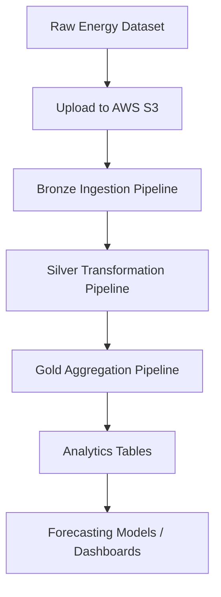
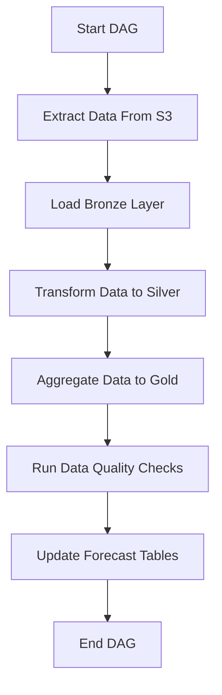

# Energy Consumption Forecasting Pipeline

## Project Overview

The **Energy Consumption Forecasting Pipeline** is a data engineering project that processes household energy consumption data using **Databricks, PySpark, and Delta Lake**.

The pipeline ingests raw CSV files from **AWS S3**, performs data cleaning and transformations, and produces aggregated datasets used for **analytics and forecasting**.

The architecture follows the **Medallion Architecture (Bronze → Silver → Gold)** pattern commonly used in modern data lakehouse systems.

---
# 📂 Dataset  

## 📌 Dataset Source  

Project-based dataset consisting of **energy consumption and grid-related data** collected from multiple structured CSV sources.

The dataset represents a **real-world energy analytics use case**, where multiple data sources are integrated and processed through an ETL pipeline for analysis and reporting.

---

### 📊 Datasets Used  

- `energy_usage.csv` → Historical household energy consumption data  
- `device_metrics.csv` → Device-level energy usage and performance metrics  
- `grid_load.csv` → Power grid load and distribution data  
- `tariff_rates.csv` → Electricity pricing and tariff information  
- `weather_data.csv` → Weather conditions affecting energy consumption  

---

These datasets simulate a **real-world energy analytics environment**, where multiple data sources are combined to generate insights such as consumption trends, load forecasting, and cost optimization.

## End-to-End Pipeline Architecture



---

# Medallion Data Architecture

## Bronze Layer

**Table**

`energy_catalog.raw.usage_records`

**Purpose**

- Store raw ingested data  
- Preserve source records  
- Enable reprocessing  

**Operations**

- CSV ingestion from S3  
- Schema inference  
- Ingestion timestamp creation  

---

## Silver Layer

**Table**

`energy_catalog.processed.usage_cleaned`

**Purpose**

- Clean and standardize raw data  
- Prepare structured datasets for analytics  

**Transformations**

- Remove duplicate records  
- Handle missing values  
- Standardize timestamps  
- Convert data types  
- Normalize column names  

---

## Gold Layer

**Table**

`energy_catalog.analytics.forecast_features`

**Purpose**

- Provide aggregated analytics datasets  
- Generate forecasting features  

**Operations**

- Hourly energy consumption metrics  
- Daily consumption aggregation  
- Peak load calculations  
- Forecast feature generation  

---

# Airflow Orchestration

The ETL workflow can be orchestrated using **Apache Airflow DAGs** to automate pipeline execution.



**Schedule**

Daily at **04:00 AM UTC**

---

# Databricks Workflow Jobs

The pipeline is organized into **Jobs**, where each job contains multiple **Tasks**.

---

## Job 1 – Data Ingestion

**Purpose**

Load raw CSV files from AWS S3 into Bronze tables.

**Tasks**

1. Read CSV files from S3  
2. Apply schema inference  
3. Add ingestion timestamp  
4. Write data to Bronze Delta tables  

**Output Table**

`energy_catalog.raw.usage_records`

---

## Job 2 – Data Transformation

**Purpose**

Clean and standardize data in Silver layer.

**Tasks**

1. Remove duplicate records  
2. Handle missing values  
3. Convert timestamp formats  
4. Standardize column names  
5. Generate time features  

**Output Table**

`energy_catalog.processed.usage_cleaned`

---

## Job 3 – Data Aggregation

**Purpose**

Generate analytical datasets for forecasting.

**Tasks**

1. Calculate hourly consumption  
2. Compute daily energy trends  
3. Generate peak consumption metrics  
4. Create forecasting feature tables  

**Output Table**

`energy_catalog.analytics.forecast_features`

---

# Data Quality Checks

Data validation rules implemented in the pipeline

- Schema validation  
- Null value detection  
- Duplicate record detection  
- Timestamp consistency checks  
- Data range validation  

**Example validation logic**

```python
if df.filter(col("global_active_power").isNull()).count() > 0:
    raise Exception("Data Quality Issue Detected")
```

---

# Error Handling and Monitoring

Pipeline failures and anomalies are logged in

`energy_catalog.logs.etl_errors`

Monitoring includes

- Logging ETL failures  
- Capturing malformed records  
- Data validation alerts  
- Job execution monitoring  

---

# Technology Stack

| Component | Technology |
|----------|------------|
| Data Storage | AWS S3 |
| AWS tools    | Glue / Crawler / MWAA |
| Processing Engine | Apache Spark / PySpark |
| Platform | Databricks |
| Data Format | Delta Lake |
| Orchestration | Apache Airflow / Databricks Workflows |
| Programming Language | Python |
| Testing | pytest |
| Version Control | Git |

---

# Business Insights Generated

The pipeline enables insights such as

- Peak electricity consumption hours  
- Daily and seasonal energy usage trends  
- Grid load monitoring  
- Tariff efficiency analysis  

These insights support **better energy forecasting and resource planning**.

---

# Project Objective

The objective of this project is to build a **scalable and reliable data engineering pipeline** that supports energy consumption analytics and forecasting while demonstrating modern **data lakehouse architecture and ETL best practices**.
