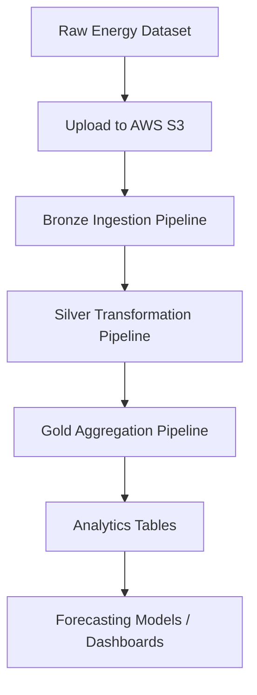
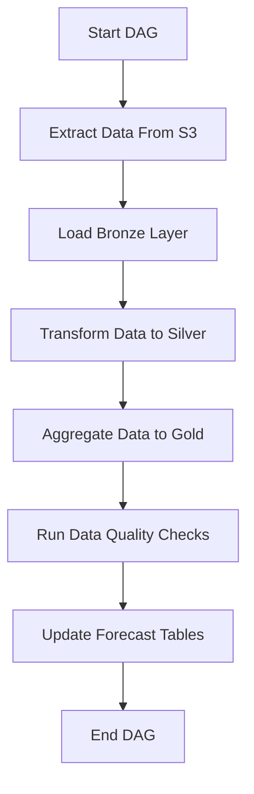

# Energy Consumption Forecasting Pipeline

# Project Overview

The **Energy Consumption Forecasting Pipeline** is a data engineering project that processes household energy consumption data using **Databricks, PySpark, and Delta Lake**.

The pipeline ingests raw CSV files from **AWS S3**, performs data cleaning and transformations, and produces aggregated datasets used for **analytics and forecasting**.

The architecture follows the **Medallion Architecture (Bronze → Silver → Gold)** pattern commonly used in modern data lakehouse systems.

---
# Project Objective

The objective of this project is to build a **scalable and reliable data engineering pipeline** that supports energy consumption analytics and forecasting while demonstrating modern **data lakehouse architecture and ETL best practices**.

# 📂 Dataset  

## 📌 Dataset Source  

Project-based dataset consisting of **energy consumption and grid-related data** collected from multiple structured CSV sources.

The dataset represents a **real-world energy analytics use case**, where multiple data sources are integrated and processed through an ETL pipeline for analysis and reporting.

---

### 📊 Datasets Used  

- `energy_usage.csv` → Historical household energy consumption data  
- `device_metrics.csv` → Device-level energy usage and performance metrics  
- `grid_load.csv` → Power grid load and distribution data  
- `tariff_rates.csv` → Electricity pricing and tariff information  
- `weather_data.csv` → Weather conditions affecting energy consumption  

---

These datasets simulate a **real-world energy analytics environment**, where multiple data sources are combined to generate insights such as consumption trends, load forecasting, and cost optimization.

## End-to-End Pipeline Architecture



---

# Medallion Data Architecture

## Bronze Layer

**Table**

`energy_catalog.raw.usage_records`

**Purpose**

- Store raw ingested data  
- Preserve source records  
- Enable reprocessing  

**Operations**

- CSV ingestion from S3  
- Schema inference  
- Ingestion timestamp creation  

---

## Silver Layer

**Table**

`energy_catalog.processed.usage_cleaned`

**Purpose**

- Clean and standardize raw data  
- Prepare structured datasets for analytics  

**Transformations**

- Remove duplicate records  
- Handle missing values  
- Standardize timestamps  
- Convert data types  
- Normalize column names  

---

## Gold Layer

**Table**

`energy_catalog.analytics.forecast_features`

**Purpose**

- Provide aggregated analytics datasets  
- Generate forecasting features  

**Operations**

- Hourly energy consumption metrics  
- Daily consumption aggregation  
- Peak load calculations  
- Forecast feature generation  

---

# Airflow Orchestration

The ETL workflow can be orchestrated using **Apache Airflow DAGs** to automate pipeline execution.



**Schedule**

Daily at **04:00 AM UTC**

---

## 📊 Data Quality Checks

The pipeline includes multiple data quality validations to ensure reliability and accuracy of the data across Bronze, Silver, and Gold layers:

- **Null Checks**: Identifies missing values in critical columns such as timestamps and meter readings.  
- **Duplicate Detection**: Ensures no duplicate records are processed across datasets.  
- **Schema Validation**: Verifies column names and data types match expected schema definitions.  
- **Range Validation**: Detects invalid values (e.g., negative energy consumption).  
- **Data Consistency**: Ensures consistent formatting and standardized values across datasets.    

**Example validation logic**

```python
if df.filter(col("global_active_power").isNull()).count() > 0:
    raise Exception("Data Quality Issue Detected")
```
## 🚨 Data Quality Alerts

The pipeline generates alerts when data quality issues are detected:

- ⚠️ Missing or null values found in critical fields  
- ⚠️ Duplicate records detected  
- ⚠️ Schema mismatches or missing columns  
- ⚠️ Invalid or out-of-range values identified
---

# Error Handling and Monitoring

Pipeline failures and anomalies are logged in

`energy_catalog.logs.etl_errors`

Monitoring includes

- Logging ETL failures  
- Capturing malformed records  
- Data validation alerts  
- Job execution monitoring  

---
## 📢 Slack Notifications

The pipeline integrates with Slack to provide real-time alerts and monitoring updates.

### 🔔 Features

- Sends alerts for data quality issues (nulls, duplicates, schema mismatches)  
- Notifies on pipeline failures or task errors  
- Provides success notifications after pipeline completion  
- Enables quick visibility for data engineers and stakeholders  

---

## ⚙️ Use Cases

- Immediate alerting for failed jobs or broken pipelines  
- Monitoring data quality issues before they impact downstream systems  
- Keeping teams informed about pipeline execution status  

---

### ✅ Benefit

Slack integration ensures **real-time monitoring, faster issue resolution, and improved pipeline reliability**.

---
# Technology Stack

| Component | Technology |
|----------|------------|
| Data Storage | AWS S3 |
| AWS tools    | Glue / Crawler / MWAA |
| Processing Engine | Apache Spark / PySpark |
| Platform | Databricks |
| Data Format | Delta Lake |
| Orchestration | Apache Airflow / Databricks Workflows |
| Programming Language | Python |
| Testing | pytest |
| Version Control | Git |

---

# Business Insights Generated

The pipeline enables insights such as

- Peak electricity consumption hours  
- Daily and seasonal energy usage trends  
- Grid load monitoring  
- Tariff efficiency analysis  

These insights support **better energy forecasting and resource planning**.

---
# 🚀 Future Enhancements

- Support real-time data processing using streaming  
- Improve data quality checks with advanced validation tools  
- Add multi-channel alerts (Slack, Email)  
- Implement CI/CD for automated deployments  
- Enhance dashboards for better insights  
- Optimize performance and reduce costs  

---
